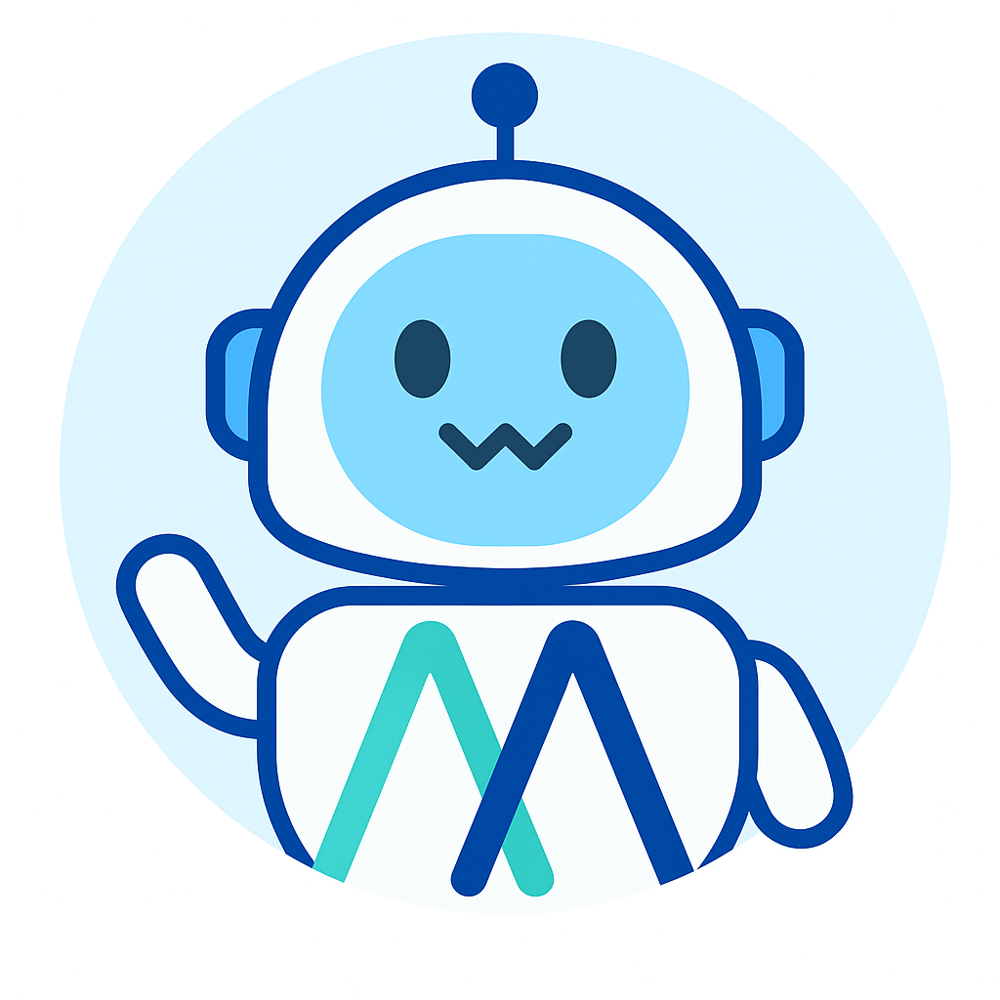

<h1 align="center">
<em>MiroFlow</em>: A Consistent Agent Framework with Reproducible Performance
</h1>


<p align="center">
<a href="https://huggingface.co/miromind-ai"></a>
<a href="https://x.com/miromind_ai"></a>
<a href="https://www.xiaohongshu.com/user/profile/663098830000000003033edc"></a>
<a href="https://discord.gg/GPqEnkzQZd"></a>
<a href="./docs/figs/wechat-group-qr-code.jpg"></a>
<a href="https://miromind.ai"></a>
</p>


<p align="center">
| <a href="https://deepwiki.com/miromind/miroflow"><b>Ask DeepWiki</b></a> | <a href="#-overview"><b>🎯 Overview</b></a> |
<a href="#-miroflow-sota-performance" target="_blank"><b>✨ Performance</b></a> |
<a href="#-miroflow-modular-ai-agent-framework" target="_black"><b>🤖 Framework</b> </a> | 
<a href="#-getting-started" target="_black"><b>🚀 Getting Started</b> </a> | 
<a href="https://github.com/MiroMindAI/MiroThinker" target="_black"><b>🌟 MiroThinker</b> </a>
</p>

<!-- <p align="center">
  <span style="
    display: inline-block;
    font-size: 1.5em;
    font-weight: bold;
    background: linear-gradient(90deg, #ff4e50, #f9d423, #1e90ff, #32cd32, #ff69b4, #8a2be2, #ff4e50);
    -webkit-background-clip: text;
    -webkit-text-fill-color: transparent;
    background-clip: text;
    text-fill-color: transparent;
    animation: rainbow-text 3s linear infinite;
  ">
    <a href="https://dr.miromind.ai/" style="color: #1e90ff; text-decoration: underline; text-decoration-thickness: 2px;"><b><u>Try our demo here!</u></b></a>
  </span>
</p>
<style>
@keyframes rainbow-text {
  0% { filter: hue-rotate(0deg);}
  100% { filter: hue-rotate(360deg);}
}
</style> -->

<p align="center">
<a href="https://dr.miromind.ai/" style="color:rgb(30, 203, 255); text-decoration: underline; text-decoration-thickness: 2px;"><b><u>Try our demo with MiroThinker here!</u></b></a>
</p>

# 🎯 Overview 



**MiroFlow** is a **battle-tested** agent framework that reliably completes complex tool-use tasks. We have extensively used it to generate high-quality, post-training agent trace data for **[MiroThinker](https://huggingface.co/collections/miromind-ai/mirothinker-v01-689301b6d0563321862d44a1)**. Some key features are:

- 🌟 **Reproducible SOTA**: **MiroFlow** consistently achieves 72.2% (pass@1 average@3) on GAIA validation set. Follow our [getting-started guide](#get-start) below, or view our many runs of gaia trace on huggingfaces. If you can't reproduce our result, please open a Github issue - We take reproducibility seriously.
- 🌟 **High Concurrency and Fault Tolerance**: **MiroFlow**  scales data collection efficiently and handles rate-limited APIs and unstable network connections with ease.
- 🌟 **Baked-in observability and evaluation**: **MiroFlow** ships with scripts for benchmarking agents and a straightforward web-ui for visualizing and debugging agent trace data.

# ✨ MiroFlow SOTA Performance

MiroFlow, equipped with Claude Sonnet 3.7 as its primary LLM, **achieved 81.8% pass@3, 82.4% maj. vote, 74.5% pass@1 (best@3), and 72.2% pass@1 (avg@3) on the GAIA validation set**. This represents **state-of-the-art (SOTA) performance** among open-source agent frameworks.


> [!NOTE]
> Our pass@1 scores are reported as both the average across three runs (avg@3) and the best score among those runs (best@3). For most other reported pass@1 results, it is unclear whether they represent an average or a best score across multiple trials (indicated with *). 

To prevent agents from retrieving answers directly from Hugging Face, we disabled access to it during the inference and trace collection.

*We have evaluated multiple agent frameworks on GAIA. Please note that some reported results may be overstated or lack clear definitions, and are not reproducible.*
In contrast, reproducing MiroFlow's results is straightforward with just a few required API keys.

# 🤖 MiroFlow: Modular AI Agent Framework

MiroFlow is a sophisticated, modular framework for building intelligent AI agents with multi-turn conversation capabilities, comprehensive tool integration, and hierarchical sub-agent support.


## Workflow Overview

MiroFlow handles user queries through a multi-stage and agentic process designed for flexibility and depth. The workflow is organized as follows:

1. **Intent Recognition & Query Augmentation**  
   User input is first analyzed by Large Language Models (LLMs) to determine intent and enrich the query for deeper understanding.

2. **Planning & Task Orchestration**  
   The main agent examines the enriched query, develops a comprehensive execution plan, and orchestrates the entire workflow—invoking tools, delegating tasks to sub-agents, and driving task progress forward.

3. **Delegation to Sub-Agents**  
   For complex or domain-specific tasks, the main agent delegates responsibilities to specialized sub-agents (such as `agent-browsing`) that possess targeted expertise. Sub-agents independently plan, act, and execute tool calls as needed.

4. **Tool Access via MCP Servers**  
   When external capabilities are required, agents leverage specialized tools by connecting to MCP (Model Context Protocol) servers.

5. **Result Synthesis & Output Alignment**  
   After task completion, a dedicated summary process synthesizes results, ensuring the output is high-quality and aligned with user instructions (or benchmark formats).

## Architecture Components

All core components are located in the `libs/` directory.

### Core System 💻

**Pipeline** (`./miroflow/src/miroflow/prebuilt/pipeline.py`)  
Main entry point that coordinates task execution. Creates and manages all components, handles error recovery, and returns final results. Serves as the factory for initializing tool managers, LLM clients, and output formatters.

**Orchestrator** (`./miroflow/src/miroflow/prebuilt/orchestrator.py`)  
Manages the conversation flow between LLM and tools. Handles multi-turn conversations, parses tool calls from LLM responses, executes tools, delegates tasks to sub-agents, and manages contexts.

**LLM Client** (`./miroflow/src/miroflow/llm/client.py`)  
Provides a unified interface for various LLM providers (Anthropic, OpenAI, Google, Qwen, DeepSeek, local deployments, etc.). Manages authentication, request formatting, retry logic, token usage tracking, and supports streaming responses.

### Tool Integration 🔧

**Tool Manager** (`./miroflow-tool/src/miroflow/tool/manager.py`)  
Comprehensive MCP server connection manager. Handles tool discovery, maintains persistent server connections, executes tool calls with advanced error handling, and supports flexible tool blacklisting.

**MCP Servers** (`./miroflow-tool/src/miroflow/tool/mcp_servers/`)  
Individual tool implementations built on FastMCP. Provides extensive capabilities including:
- Code execution and analysis (`./python_server.py`)
- Visual perception (`./vision_mcp_server.py`)
- Web search and content retrieval (`./searching_mcp_server.py`)
- Audio transcription (`./audio_mcp_server.py`)
- Enhanced reasoning capabilities (`./reasoning_mcp_server.py`)
- Document processing and analysis (`./reading_mcp_server.py`)

### Agent System 👷

**Sub-Agents**  
Specialized agents designed for specific domains (e.g., `agent-browsing` for web navigation). Each sub-agent maintains dedicated tool sets and custom prompts, allowing the main agent to delegate tasks requiring specialized expertise. Agent definitions are managed through configuration files with prompts and descriptions customized in `./miroflow/src/miroflow/utils/prompt_utils.py` and `tool_utils.py`.

### Support Systems ⚙️

**Configuration System** (`./miroflow/src/miroflow/prebuilt/config/`)  
Hydra-powered configuration management with structured YAML files covering agents, LLMs, benchmarks, and pricing models.

**Output Formatter** (`./miroflow/src/miroflow/utils/io_utils.py`)  
Intelligent response formatting system that adapts agent outputs to various benchmark requirements, extracts structured answers, and handles multiple output formats seamlessly.

**Task Logger** (`./miroflow/src/miroflow/logging/`)  
Comprehensive logging infrastructure that captures agent interactions, tool executions, performance metrics, and error traces for debugging, analysis, and system optimization.

<a id="get-start"></a>
# 🚀 Getting Started

## Prerequisites
> [!TIP]
> we recommend using [`uv`](https://docs.astral.sh/uv/) with `python>= 3.12` 

**Step 1:** Clone repo and prepare python environment:

```bash
## clone the repo
git clone https://github.com/MiroMindAI/MiroFlow
cd MiroFlow/apps/run-agent
## prepare python environment
uv sync
```

**Step 2:** Set up environment dependencies:

a. Set up `MiroFlow/apps/prepare-benchmark/.env` by:
```bash
## copy environment variable template and prepare yours in .env file
cd MiroFlow/apps/prepare-benchmark
cp .env.template .env
vim .env 
```
Required environment variables:  
- `HF_TOKEN` (for downloading datasets from Hugging Face) 

Optional environment variables:
- `DATA_DIR` (Data loading directory, by default `../../data`)


b. Set up `MiroFlow/apps/run-agent/.env` by:
```bash
## copy environment variable template and prepare yours in .env file
cd MiroFlow/apps/run-agent
cp .env.template .env
vim .env
```
Required environment variables:  
- `OPENROUTER_API_KEY` (Using OpenRouter to provide primary agent model) 
- `ANTHROPIC_API_KEY` (for vision tools)
- `OPENAI_API_KEY` (for audio tools, intent recognition, and answer extraction)
- `GEMINI_API_KEY` (for YouTube tasks)  
- `SERPER_API_KEY` (for Google search and website scraping)  
- `JINA_API_KEY` (for website scraping)
- `E2B_API_KEY` (for the Linux sandbox)

Optional environment variables:
- `HTTPS_PROXY` (for network proxy, null by default )
- `DATA_DIR` (Data loading directory, by default `../../data`)

If you wish to use a different LLM as the primary agent model, you will need to provide the corresponding API keys.


**Step 3:** Prepare E2B Sandbox (Optional)

> [!TIP]
> We provide a public E2B sandbox template. Follow this step if you want to reproduce.
>
> For the E2B sandbox service, we recommend setting up a Linux Docker image with a comprehensive set of apt and Python packages pre-installed. Without these pre-installed packages, the agent will need to spend extra steps and context installing them, resulting in reduced token efficiency.
>
> you need to have `npm` install and `docker` running locally.


1. Install `e2b` command line and login:

```shell
## install e2b
npm install -g @e2b/cli
## check that it is available
which e2b 
```

2. Download our pre-configured Dockerfile:
[e2b.Dockerfile](https://github.com/MiroMindAI/MiroFlow/blob/main/docs/e2b.Dockerfile).

```shell
wget https://github.com/MiroMindAI/MiroFlow/blob/main/docs/e2b.Dockerfile
```

3. Run `e2b template build` command [check official doc here](https://e2b.dev/docs/sdk-reference/cli/v1.0.2/template), use `all_pip_apt_pkg` as the name of template.

```shell
## build the template with `docker build` locally
E2B_ACCESS_TOKEN=${your-token}
e2b template build -c "/root/.jupyter/start-up.sh" -n "all_pip_apt_pkg" -d ./e2b.Dockerfile
## check that template is built successfully
E2B_ACCESS_TOKEN=${your-token} e2b template list
```

For additional information, please see the [E2B Docker documentation](https://e2b.dev/docs/sandbox-template).


## Runing a single task

Run a single task:

```bash
## run a task with instruction
cd MiroFlow/apps/run-agent
uv run main.py trace --task="your task description" --task_file_name="path to related task file"
```

## Evaluate on Benchmark

Run prebuilt agent on the benchmark data:

```bash
## download data
cd MiroFlow/apps/prepare-benchmark
uv run main.py get gaia-val
## run the code
cd MiroFlow/apps/run-agent
uv run main.py common-benchmark benchmark=gaia-validation
```

To perform parallel multi-run evaluations, you can use the provided script:

```bash
cd MiroFlow/apps/run-agent
bash scripts/claude-sonnet-3.7/run_evaluate_multiple_runs_gaia-validation.sh
```

# 🌟 MiroThinker (7B/14B/32B): Our Open-Source Agentic Models

[](https://github.com/MiroMindAI/MiroThinker)


MiroThinker is our suite of open-source agentic models, designed to work seamlessly with the MiroFlow framework. Our models are specifically built to handle **complex, multi-tool tasks**, leveraging the reproducible and robust foundation that MiroFlow provides.

By combining MiroFlow’s reliable orchestration with MiroThinker’s advanced reasoning capabilities, we offer a powerful, end-to-end solution for building high-performing, reproducible AI agents.
These models are a direct result of our extensive data collection efforts, utilizing MiroFlow to generate high-quality, post-training agent trace data. This unique approach enables MiroThinker to excel in planning, executing, and reasoning through complex multi-step tasks.
We invite the community to explore and build upon these models. For more details on the architecture and implementation, please take a look at our codebase.

# 🤔 Why Choose MiroFlow

Among the many agent frameworks out there, why do we believe **MiroFlow** is worth your time?

### 1. Stable and Reproducible Performance  
Many open-source agent projects list impressive benchmark scores in their README, but often lack clear testing conditions or are difficult to reproduce.  
MiroFlow was built from day one with **reproducibility** as a core principle:  
- Fully open evaluation scripts and configuration files  
- Multiple independent GAIA trace runs published on HuggingFace  
- If you cannot reproduce our results, we actively encourage you to open a GitHub issue — we will help investigate and resolve it promptly  

### 2. Continuous Updates and Community Co-Creation  
MiroFlow is not a “one-and-done” academic repo, but a continuously evolving engineering project:  
- **Monthly releases** with priority given to community feedback  
- New tools, enhanced sub-agents, and expanded benchmark coverage  
- Pull requests and feature proposals are welcome — we carefully review and credit all contributors in our changelog  

### 3. Seamless Transition from Benchmark to Production  
MiroFlow is designed not only to achieve high benchmark scores, but also to operate reliably in production environments:  
- High concurrency and robust fault tolerance  
- Built-in observability (support visual UI + full logging system)  
- Flexible integration with various LLMs and tools  

## 🎉 Join Our Communities! 

- Follow us on social media for timely updates!
    - [X - MiroMindAI](https://x.com/miromind_ai)
    - [RedNote - MiroMind](https://www.xiaohongshu.com/user/profile/663098830000000003033edc)
- Join our communities:
    - [Discord server](https://discord.gg/GPqEnkzQZd)
    - <details>
        <summary>WeChat Group</summary>
        <div align="center" style="display: flex; justify-content: center; gap: 40px;">
            <div>
                <p>WeChat Bot QR Code</p>
                
            </div>
            <div>
                <p>WeChat Group QR Code</p>
                
            </div>
        </div>
      </details>

