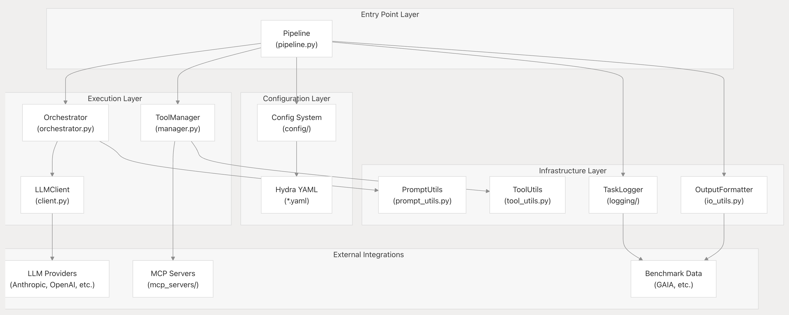

<h1 align="center">
<em>MiroFlow</em>: A Consistent Agent Framework with Reproducible Performance
</h1>


<p align="center">
<a href="https://huggingface.co/miromind-ai"></a>
<a href="https://x.com/miromind_ai"></a>
<a href="https://www.xiaohongshu.com/user/profile/663098830000000003033edc"></a>
<a href="https://discord.gg/GPqEnkzQZd"></a>
<a href="./docs/figs/wechat-group-qr-code.jpg"></a>
<a href="https://deepwiki.com/MiroMindAI/MiroFlow"></a>
<!-- DeepWiki badge generated by https://deepwiki.ryoppippi.com/ -->
<a href="https://miromind.ai"></a>

</p>


<p align="center">
<a href="https://dr.miromind.ai/" style="color:rgb(30, 203, 255); text-decoration: underline; text-decoration-thickness: 2px;"><b><u>Try our demo with MiroThinker here!</u></b></a>
</p>

## 📚 Table of Contents

- [🎯 Overview](#-overview)
- [✨ MiroFlow SOTA Performance](#-miroflow-sota-performance)
- [🤖 MiroFlow: Modular AI Agent Framework](#-miroflow-modular-ai-agent-framework)
  - [Workflow Overview](#workflow-overview)
  - [Architecture Components](#architecture-components)
    - [Core System 💻](#core-system-)
    - [Tool Integration 🔧](#tool-integration-)
    - [Agent System 👷](#agent-system-)
    - [Support Systems ⚙️](#support-systems-️)
- [🚀 Getting Started](#-getting-started)
  - [Prerequisites](#prerequisites)
  - [Runing a single task](#runing-a-single-task)
  - [Evaluate on Benchmark](#evaluate-on-benchmark)
  - [[Optional] Customized Configuration](#optional-customized-configuration)
- [🌟 MiroThinker](#-mirothinker)
- [❓ FAQ](#-faq)
- [🎉 Join Our Communities!](#-join-our-communities)

# 🎯 Overview 


**MiroFlow** is a **battle-tested** agent framework that reliably completes complex tool-use tasks. We have extensively used it to generate high-quality, post-training agent trace data for **[MiroThinker](https://huggingface.co/collections/miromind-ai/mirothinker-v01-689301b6d0563321862d44a1)**, our suite of open-source agentic models. Some key features are:

- 🌟 **Reproducible SOTA**: **MiroFlow** consistently achieves 72.2% (pass@1 average@3) on GAIA validation set. Follow our [getting-started guide](#get-start) below, or view our many runs of gaia trace on huggingfaces. If you can't reproduce our result, please open a Github issue - We take reproducibility seriously.
- 🌟 **High Concurrency and Fault Tolerance**: **MiroFlow**  scales data collection efficiently and handles rate-limited APIs and unstable network connections with ease.
- 🌟 **Baked-in observability and evaluation**: **MiroFlow** ships with scripts for benchmarking agents and a straightforward web-ui for visualizing and debugging agent trace data.

# ✨ MiroFlow SOTA Performance

MiroFlow, equipped with Claude Sonnet 3.7 as its primary LLM, **achieved 81.8% pass@3, 82.4% maj. vote, 74.5% pass@1 (best@3), and 72.2% pass@1 (avg@3) on the GAIA validation set**. This represents **state-of-the-art (SOTA) performance** among open-source agent frameworks.


> [!NOTE]
> Our pass@1 scores are reported as both the average across three runs (avg@3) and the best score among those runs (best@3). For most other reported pass@1 results, it is unclear whether they represent an average or a best score across multiple trials (indicated with *). 

To prevent agents from retrieving answers directly from Hugging Face, we disabled access to it during the inference and trace collection.

*We have evaluated multiple agent frameworks on GAIA. Please note that some reported results may be overstated or lack clear definitions, and are not reproducible.*
In contrast, reproducing MiroFlow's results is straightforward with just a few required API keys.

# 🤖 MiroFlow: Modular AI Agent Framework

MiroFlow is a sophisticated, modular framework for building intelligent AI agents with multi-turn conversation capabilities, comprehensive tool integration, and hierarchical sub-agent support.


## Workflow Overview

MiroFlow handles user queries through a multi-stage and agentic process designed for flexibility and depth. The workflow is organized as follows:

1. **Intent Recognition & Query Augmentation**  
   LLMs analyze user input to detect intent and refine the query.

2. **Planning & Task Orchestration**  
   The main agent drafts an execution plan, invokes tools, and coordinates sub-agents.

3. **Delegation to Sub-Agents**  
   Specialized agents (e.g., agent-browsing) handle complex or domain-specific tasks. Sub-agents independently plan, act, and execute tool calls as needed.

4. **Tool Access via MCP Servers**  
   When external capabilities are required, agents leverage specialized tools by connecting to MCP (Model Context Protocol) servers.

5. **Result Synthesis & Output Alignment**  
   After task completion, a dedicated summary process synthesizes results, ensuring the output is high-quality and aligned with user instructions (or benchmark formats).

## Architecture Components

All core components are located in the `MiroFlow/libs/` directory.

```
MiroFlow/libs/
├── miroflow/
│   └── src/miroflow/
│       ├── prebuilt/
│       │   ├── pipeline.py              # Pipeline: coordinates task execution
│       │   ├── orchestrator.py          # Orchestrator: manages LLM ↔ tool flow
│       │   └── config/                  # Hydra configs for agents, LLMs, pricing
│       ├── llm/
│       │   └── client.py                # Unified LLM client
│       ├── utils/
│       │   ├── io_utils.py              # Output formatting utilities
│       │   ├── prompt_utils.py          # Prompt definitions for agents
│       │   └── tool_utils.py            # Tool configuration helpers
│       └── logging/                     # Task logging & metrics
│
├── miroflow-tool/
│   └── src/miroflow/tool/
│       ├── manager.py                   # Tool Manager: MCP server connector
│       └── mcp_servers/                 # Individual MCP tool servers
│           ├── python_server.py         # Code execution
│           ├── vision_mcp_server.py     # Visual perception
│           ├── searching_mcp_server.py  # Web search & retrieval
│           ├── audio_mcp_server.py      # Audio transcription
│           ├── reasoning_mcp_server.py  # Enhanced reasoning
│           └── reading_mcp_server.py    # Document processing
```



### Core System 💻

- **Pipeline** (`./miroflow/src/miroflow/prebuilt/pipeline.py`): Main entry point that creates and manages all components, handles error recovery, and returns final results

- **Orchestrator** (`./miroflow/src/miroflow/prebuilt/orchestrator.py`): Manages multi-turn conversations, parses tool calls, executes tools, and delegates to sub-agents

- **LLM Client** (`./miroflow/src/miroflow/llm/client.py`): Unified interface supporting Anthropic, OpenAI, Google, Qwen, DeepSeek, and local deployments

### Tool Integration 🔧

- **Tool Manager** (`./miroflow-tool/src/miroflow/tool/manager.py`) : Comprehensive MCP server connection manager with tool discovery, persistent connections, and error handling

- **MCP Servers** (`./miroflow-tool/src/miroflow/tool/mcp_servers/`) : Individual tool implementations built on FastMCP. Provides extensive capabilities including:
  - Code execution and analysis (`./python_server.py`)
  - Visual perception (`./vision_mcp_server.py`)
  - Web search and content retrieval (`./searching_mcp_server.py`)
  - Audio transcription (`./audio_mcp_server.py`)
  - Enhanced reasoning capabilities (`./reasoning_mcp_server.py`)
  - Document processing and analysis (`./reading_mcp_server.py`)

### Agent System 👷

**Sub-Agents**  
Specialized agents designed for specific domains (e.g., `agent-browsing` for web navigation). Each sub-agent maintains dedicated tool sets and custom prompts, allowing the main agent to delegate tasks requiring specialized expertise. Agent definitions are managed through configuration files with prompts and descriptions customized in `./miroflow/src/miroflow/utils/prompt_utils.py` and `tool_utils.py`.

### Support Systems ⚙️

- **Configuration System** (`./miroflow/src/miroflow/prebuilt/config/`) : Hydra-powered YAML configuration for agents, LLMs, benchmarks, and pricing

- **Output Formatter** (`./miroflow/src/miroflow/utils/io_utils.py`) : Intelligent response formatting that adapts to various benchmark requirements

- **Task Logger** (`./miroflow/src/miroflow/logging/`) : Comprehensive logging for agent interactions, tool executions, and performance metrics

### Execution Pipeline Data Flow


<a id="get-start"></a>
# 🚀 Getting Started

## Prerequisites
> [!TIP]
> we recommend using [`uv`](https://docs.astral.sh/uv/) with `python>= 3.12` 

**Step 1:** Clone repo and prepare python environment:

```bash
## clone the repo
git clone https://github.com/MiroMindAI/MiroFlow
cd MiroFlow/apps/run-agent

## prepare python environment
uv sync
```

**Step 2:** Set up environment dependencies:

a. Set up `MiroFlow/apps/prepare-benchmark/.env` by:
```bash
## copy environment variable template and prepare yours in .env file
cd MiroFlow/apps/prepare-benchmark

# Edit .env with your actual API keys
cp .env.template .env
```
Edit `.env` to configure environment variables:  
```
# For downloading datasets from Hugging Face
HF_TOKEN="<your-huggingface-token>"

# [Optional] Data loading directory, by default `../../data`
DATA_DIR="../../data" # relative to this file 
```

b. Set up `MiroFlow/apps/run-agent/.env` by:
```bash
## copy environment variable template and prepare yours in .env file
cd MiroFlow/apps/run-agent

# Edit .env with your actual API keys
cp .env.template .env
```
Edit `.env` to configure environment variables:  
```
# Using OpenRouter to provide primary agent model
OPENROUTER_API_KEY=""
OPENROUTER_BASE_URL="https://openrouter.ai/api/v1"

# Anthropic, for vision tools
ANTHROPIC_API_KEY=""
ANTHROPIC_BASE_URL="https://api.anthropic.com"

# OpenAI, for audio tools, intent recognition, and answer extraction
OPENAI_API_KEY=""
OPENAI_BASE_URL="https://api.openai.com/v1"

# Gemini, for YouTube tasks
GEMINI_API_KEY=""

# Third party API keys
# For Google search and website scraping
SERPER_API_KEY=""
# For website scraping
JINA_API_KEY=""
# For the Linux sandbox
E2B_API_KEY=""

# [Optional] NewAPI, alternative to OpenRouter 
NEWAPI_API_KEY=""
NEWAPI_BASE_URL=""

# [Optional] for network proxy, null by default
HTTPS_PROXY=""
# [Optional] Data loading directory, by default `../../data`
DATA_DIR="../../data"
```

If you wish to use a different LLM as the primary agent model, you will need to provide the corresponding API keys.


**Step 3:** Prepare E2B Sandbox (Optional)

> [!TIP]
> We provide a public E2B sandbox template. Follow this step if you want to reproduce.
>
> For the E2B sandbox service, we recommend setting up a Linux Docker image with a comprehensive set of apt and Python packages pre-installed. Without these pre-installed packages, the agent will need to spend extra steps and context installing them, resulting in reduced token efficiency.
>
> you need to have `npm` install and `docker` running locally.


1. Install `e2b` command line and login:

```shell
## install e2b
npm install -g @e2b/cli
## check that it is available
which e2b 
```

2. Download our pre-configured Dockerfile:
[e2b.Dockerfile](https://github.com/MiroMindAI/MiroFlow/blob/main/docs/e2b.Dockerfile).

```shell
wget https://github.com/MiroMindAI/MiroFlow/blob/main/docs/e2b.Dockerfile
```

3. Run `e2b template build` command [check official doc here](https://e2b.dev/docs/sdk-reference/cli/v1.0.2/template), use `all_pip_apt_pkg` as the name of template.

```shell
## build the template with `docker build` locally
E2B_ACCESS_TOKEN=${your-token}
e2b template build -c "/root/.jupyter/start-up.sh" -n "all_pip_apt_pkg" -d ./e2b.Dockerfile
## check that template is built successfully
E2B_ACCESS_TOKEN=${your-token} e2b template list
```

For additional information, please see the [E2B Docker documentation](https://e2b.dev/docs/sandbox-template).


## Runing a single task

Run a single task:

```bash
## run a task with instruction
cd MiroFlow/apps/run-agent
uv run main.py trace --task="your task description" --task_file_name="path to related task file"
```

## Evaluate on Benchmark

Run prebuilt agent on the benchmark data:

```bash
## download data
cd MiroFlow/apps/prepare-benchmark
uv run main.py get gaia-val
## run the code
cd MiroFlow/apps/run-agent
uv run main.py common-benchmark benchmark=gaia-validation
```

To perform parallel multi-run evaluations, you can use the provided script:

```bash
cd MiroFlow/apps/run-agent
bash scripts/claude-sonnet-3.7/run_evaluate_multiple_runs_gaia-validation.sh
```

## [Optional] Customized Configuration

MiroFlow uses [Hydra](https://hydra.cc/) for flexible configuration management, supporting different setups for LLMs, agents, benchmarks, and pricing models.

## Structure

```
MiroFlow/libs/miroflow/src/miroflow/prebuilt/config
├── config.yaml              # Main configuration with defaults
├── agent/                   # Agent configurations (tools, limits)
├── benchmark/               # Benchmark configurations (datasets, execution)
└── llm/                     # Language model configurations (providers, models)
```

## Usage

Run with default configuration:
```bash
cd MiroFlow/apps/run-agent
uv run main.py common-benchmark
```

Default configuration is defined in  
`MiroFlow/libs/miroflow/src/miroflow/prebuilt/config/config.yaml`:

```yaml
# conf/config.yaml
defaults:
  - llm: claude_openrouter
  - agent: miroflow
  - benchmark: gaia-validation
  - pricing: _default

# Other configurations...
```

| Component  | Default Value         | File Path                                                                 |
|------------|----------------------|---------------------------------------------------------------------------|
| LLM        | `claude_openrouter`  | `libs/miroflow/src/miroflow/prebuilt/config/llm/claude_openrouter.yaml`                                   |
| Agent      | `miroflow`           | `libs/miroflow/src/miroflow/prebuilt/config/agent/miroflow.yaml`                        |
| Benchmark  | `gaia-validation`    | `libs/miroflow/src/miroflow/prebuilt/config/benchmark/gaia-validation.yaml`                                       |


## Override Configurations

### Component Override
Switch between existing configurations using the filename (without `.yaml`):
```bash
uv run main.py common-benchmark llm=<filename> agent=<filename> benchmark=<filename>
```

For example, if you have `conf/llm/claude_openrouter.yaml`, use `llm=claude_openrouter`


### Parameter Override
Override specific parameters:
```bash
cd MiroFlow/apps/run-agent
uv run main.py common-benchmark llm.temperature=0.1 agent.main_agent.max_turns=30
```

## Create Custom Configurations

1. **Create new config file** in the appropriate subdirectory (e.g., `conf/llm/my_config.yaml`)
2. **Inherit from defaults** using Hydra's composition:
   ```yaml
   defaults:
     - _default  # Inherit base configuration
     - _self_    # Allow self-overrides
   
   # Your custom parameters
   parameter: value
   ```
3. **Use your config**: `uv run main.py common-benchmark component=my_config`


# 🌟 MiroThinker


[MiroThinker](https://github.com/MiroMindAI/MiroThinker) (7B/14B/32B) is our suite of open-source agentic models, designed to work seamlessly with the MiroFlow framework. Our models are specifically built to handle **complex, multi-tool tasks**, leveraging the reproducible and robust foundation that MiroFlow provides.

By combining MiroFlow’s reliable orchestration with MiroThinker’s advanced reasoning capabilities, we offer a powerful, end-to-end solution for building high-performing, reproducible AI agents.
These models are a direct result of our extensive data collection efforts, utilizing MiroFlow to generate high-quality, post-training agent trace data. This unique approach enables MiroThinker to excel in planning, executing, and reasoning through complex multi-step tasks.
We invite the community to explore and build upon these models. For more details on the architecture and implementation, please take a look at our codebase.

# ❓ FAQ

**Q: What is the estimated cost of running the GAIA validation set for a single run?** <br>
**A**: The cost is approximately **$450 USD** for a run without a cache. Enabling the cache can significantly reduce this cost by 50-67%, bringing it down to the **$150 - $225** range.


**Q: How long does it take to run the GAIA validation set for a single run?** <br>
**A**: With the `max_concurrent` parameter set to 20, a full run takes about **5 hours** to complete.

**Q: Are all the specified APIs required?** <br>
**A**: **Yes.** To fully reproduce our published results, access to all the listed APIs is necessary.


**Q: What is the difference between MiroFlow and MiroThinker?** <br>
**A**:  **MiroFlow** is primarily focused on interacting with proprietary models; **MiroThinker** is designed for our own open-source models.

We plan to merge these two projects in the future to create a single, unified platform.

## 🎉 Join Our Communities! 

- Follow us on social media for timely updates!
    - [X - MiroMindAI](https://x.com/miromind_ai)
    - [RedNote - MiroMind](https://www.xiaohongshu.com/user/profile/663098830000000003033edc)
- Join our communities:
    - [Discord server](https://discord.gg/GPqEnkzQZd)
    - <details>
        <summary>WeChat Group</summary>
        <div align="center" style="display: flex; justify-content: center; gap: 40px;">
            <div>
                <p>WeChat Bot QR Code</p>
                
            </div>
            <div>
                <p>WeChat Group QR Code</p>
                
            </div>
        </div>
      </details>

