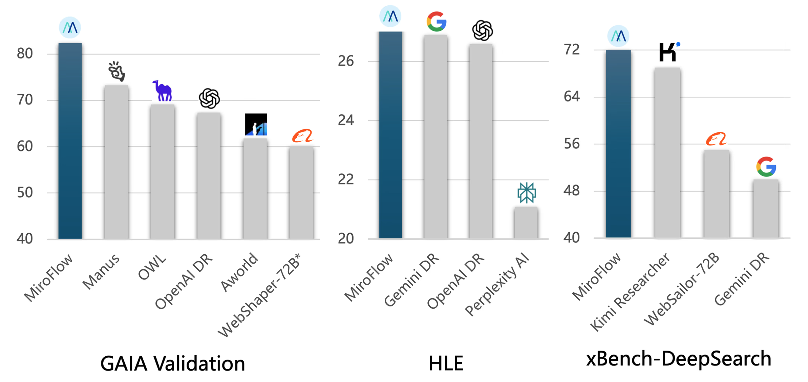

<div align="center">
  
</div>

<br> 

<div align="center">

[](https://miromindai.github.io/MiroFlow/)
[](https://dr.miromind.ai/)
[](https://huggingface.co/collections/miromind-ai/mirothinker-v02-68af084a18035f57b17cd902)
[](https://huggingface.co/datasets/miromind-ai/MiroVerse-v0.1)

[](https://github.com/MiroMindAI)
[](https://miromind.ai/)
[](https://discord.com/invite/GPqEnkzQZd)
[](https://huggingface.co/datasets/miromind-ai/MiroFlow-Benchmarks/resolve/main/assets/wechat.png)
[](https://www.xiaohongshu.com/user/profile/5e353bd80000000001000239)

</div>

<div align="center">

### 🚀 [Try our Demo!](https://dr.miromind.ai/) | 📚 [Full Documentation](https://miromindai.github.io/MiroFlow/)｜[English](README.md)｜[日本語](README_ja.md)

</div>

<table align="center" style="border: 1px solid #ccc; border-radius: 8px; padding: 12px; background-color: #f9f9f9; width: 60%;">
  <tr>
    <td style="text-align: center; padding: 10px;">
      <strong>研究助手演示</strong> - 
      <span style="font-size: 0.9em; color: #555;">阅读 CVPR 2025 最佳论文并提供研究建议</span>
      <br>
      <video src="https://github.com/user-attachments/assets/99ed3172-6e9a-467a-9ccb-be45957fe2e4"
             controls muted preload="metadata"
             width="50%" height="50%"
      </video>
    </td>
  </tr>
</table>

## 📋 目录

- [📰 新闻与更新](#-新闻与更新)
- [🤖 什么是 MiroFlow？](#-什么是-miroflow)
- [✨ 基准测试性能](#-基准测试性能)
- [🚀 5分钟快速开始](#-5分钟快速开始)
- [🤖 MiroFlow 框架](#-miroflow-ai智能体基础框架)
- [🤝 贡献](#-贡献)
- [❓ 常见问题](#-常见问题)
- [📄 许可证与支持](#-许可证与支持)
- [👥 致谢与贡献者](#-致谢与贡献者)

## 📰 新闻与更新

- **[2025-09-15]**: 🎉🎉 **MiroFlow v0.3** - 增强的代码库架构和显著改进的基准测试性能。MiroFlow 现在在未来预测基准测试中排名第一。
- **[2025-08-27]**: **MiroFlow v0.2** - 在[多个智能体基准测试](https://miromind.ai/blog/miroflow)中实现了最先进的性能，包括 HLE (27.2%)、HLE-Text-Only (29.5%)、BrowserComp-EN (33.2%)、BrowserComp-ZH (47.1%) 和 xBench-DeepSearch (72.0%)
- **[2025-08-26]**: 发布了 [GAIA 验证轨迹](docs/public_trace.md) (73.94% pass@1) 和用于本地部署的 [Gradio 演示](https://github.com/MiroMindAI/MiroThinker/tree/main/apps/gradio-demo)
- **[2025-08-08]**: 🎉 **MiroFlow v0.1** - 框架、模型和训练数据的完整开源发布

---

## 🤖 什么是 MiroFlow？

**MiroFlow** 是一个用于构建智能 AI 智能体的综合框架，在复杂推理任务上实现了最先进的性能。它提供增强的对话管理、灵活的工具集成以及跨多个数据集的广泛基准评估。

**MiroThinker** 是基于此框架构建的开源智能体模型系列。

### 🌟 核心亮点

- 🏆 **最先进的性能**: 在[多个智能体基准测试](https://miromindai.github.io/miroflow-private/v0.3/evaluation_overview/)中排名第一
- 📊 **优质训练数据**: 通过 [MiroVerse](https://huggingface.co/datasets/miromind-ai/MiroVerse-v0.1) 精选的数据集
- 🤖 **开源模型**: 在 [MiroThinker](https://huggingface.co/collections/miromind-ai/mirothinker-v01-689301b6d0563321862d44a1) 的完整集合
- 🔧 **完整训练栈**: 在 [MiroTrain](https://github.com/MiroMindAI/MiroTrain) 的 SFT/DPO 配方
- 🎯 **高级强化学习**: 通过 [MiroRL](https://github.com/MiroMindAI/MiroRL) 的强化学习

### ✨ 基准测试性能


截至 2025 年 9 月 10 日，我们在 FutureX 基准测试排行榜上获得了第一名。

<div align="center">
  
</div>

我们在一系列基准测试上对 MiroFlow 进行了评估，包括 **GAIA**、**HLE**、**BrowseComp** 和 **xBench-DeepSearch**，并取得了最先进的结果。

| 模型/框架 | GAIA Val | HLE | HLE-Text | BrowserComp-EN | BrowserComp-ZH | xBench-DeepSearch |
|-----------|----------|-----|----------|----------------|----------------|-------------------|
| **MiroFlow** | **82.4%** | **27.2%** | 29.5% | 33.2% | **47.1%** | **72.0%** |
| OpenAI Deep Research | 67.4% | 26.6% | - | **51.5%** | 42.9% | - |
| Gemini Deep Research | - | 26.9% | - | - | - | 50+% |
| Kimi Researcher | - | - | 26.9% | - | - | 69.0% |
| WebSailor-72B | 55.4% | - | - | - | 30.1% | 55.0% |
| Manus | 73.3% | - | - | - | - | - |
| DeepSeek v3.1 | - | - | **29.8%** | - | - | 71.2% |

# 🚀 5分钟快速开始

克隆仓库，配置您的 API 密钥，并运行您的第一个智能 AI 智能体。您只需要一个 `OPENROUTER_API_KEY`。

## 📋 先决条件

- **Python**: 3.12 或更高版本
- **包管理器**: [`uv`](https://docs.astral.sh/uv/)
- **操作系统**: Linux, macOS

## ⚡ 快速设置

**示例**: 具有文件处理功能的智能文档分析。

```bash
# 1. 克隆并设置
git clone https://github.com/MiroMindAI/MiroFlow && cd MiroFlow
uv sync

# 2. 配置 API 密钥
cp .env.template .env
# 编辑 .env 并添加您的 OPENROUTER_API_KEY

# 3. 运行您的第一个智能体
uv run main.py trace --config_file_name=agent_quickstart_1 --task="What is the first country listed in the XLSX file that have names starting with Co?" --task_file_name="data/FSI-2023-DOWNLOAD.xlsx"
```

🎉 **预期输出**: 您的智能体应该返回 **\boxed{Congo Democratic Republic}** 😊

> **💡 提示**: 如果遇到问题，请检查您的 API 密钥是否在 `.env` 文件中正确设置，以及是否安装了所有依赖项。

**🎯 综合基准测试套件**:
- **GAIA Validation**: 通用 AI 助手基准测试。([论文](https://arxiv.org/abs/2311.12983))
- **GAIA-Text-103**: GAIA Validation 的纯文本任务子集。([论文](https://arxiv.org/abs/2505.22648))
- **HLE**: 人类最后的考试。([论文](https://arxiv.org/abs/2501.14249))
- **HLE-Text-500**: HLE 的纯文本任务子集。([论文](https://arxiv.org/pdf/2504.21776))

按照我们的详细指南在我们的[基准测试文档](https://miromindai.github.io/MiroFlow/v0.3/evaluation_overview/)中重现基准测试结果

# 🤖 MiroFlow: AI 智能体基础框架

MiroFlow 是一个高性能、模块化的框架，用于构建在复杂推理任务上提供最先进结果的智能 AI 智能体。该框架具有先进的多轮对话功能、广泛的工具生态系统集成以及分层子智能体编排，以实现最佳任务完成。了解更多关于我们的智能体[工作流架构](https://miromindai.github.io/MiroFlow/v0.3/core_concepts/)。

<div align="center">

</div>

## 🤝 贡献

我们欢迎社区的贡献！无论您是修复错误、添加功能还是改进文档，您的帮助都是受欢迎的。

- 📋 **问题反馈**: 通过 [GitHub Issues](https://github.com/MiroMindAI/MiroFlow/issues) 报告错误或请求功能
- 🔀 **拉取请求**: 通过拉取请求提交改进
- 💬 **讨论**: 加入我们的 [Discord 社区](https://discord.com/invite/GPqEnkzQZd) 进行问题讨论

## ❓ 常见问题

<details>
<summary><strong>我需要什么 API 密钥？</strong></summary>
<br>
您只需要一个 OpenRouter API 密钥即可开始。OpenRouter 通过单一 API 提供对多个语言模型的访问。
</details>

<details>
<summary><strong>除了 OpenRouter，我可以使用其他语言模型吗？</strong></summary>
<br>
是的，MiroFlow 支持各种语言模型。查看我们的文档了解配置详情。
</details>

<details>
<summary><strong>如何重现基准测试结果？</strong></summary>
<br>
按照我们详细的<a href="https://miromindai.github.io/MiroFlow/v0.3/evaluation_overview/">基准测试文档</a>获取逐步重现指南。
</details>

<details>
<summary><strong>是否有商业支持？</strong></summary>
<br>
如需商业咨询和企业支持，请通过我们的<a href="https://miromind.ai/">官方网站</a>联系我们。
</details>

## 📄 许可证与支持

本项目在 Apache License 2.0 下许可。

<div align="center">
    
</div>

### 参考文献

技术报告即将发布！

```
@misc{2025mirothinker,
    title={MiroFlow: An Open-Source Agentic Framework for Deep Research},
    author={MiroMind AI Team},
    howpublished={\url{https://github.com/MiroMindAI/MiroFlow}},
    year={2025}
}
```

## 👥 致谢与贡献者

- **基准测试贡献者** 提供了综合评估数据集
- **开源社区** 提供了使这一切成为可能的工具和库

我们感谢所有帮助 MiroFlow 变得更好的贡献者：

<a href="https://github.com/MiroMindAI/MiroFlow/graphs/contributors">
  
</a>

加入我们的社区，帮助我们构建 AI 智能体的未来！
